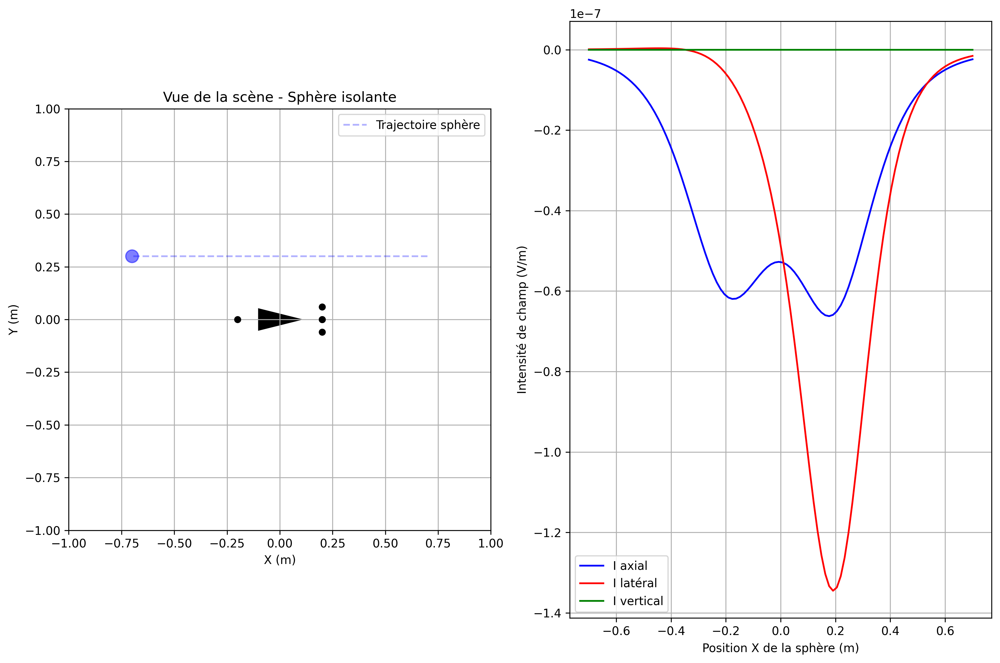

# Navigation Bio-inspirée par Sens Électrique

## Introduction

On se propose ici d'explorer la navigation bio-inspirée basée sur l'électrolocation, un sens utilisé par certains poissons d'eau douce comme l'Elephantnose. Ces poissons génèrent un champ électrique et détectent les perturbations causées par les objets environnants, leur permettant de naviguer dans des eaux troubles ou la nuit. 

L'objectif est triple :
1. Développer un simulateur de navigation 2D basé sur la détection électrique
2. Implémenter des lois de commande bio-inspirées pour l'évitement d'obstacles
3. Étendre le modèle à une simulation dynamique

Cette étude s'inscrit dans le domaine de la robotique bio-inspirée, un champ qui cherche à adapter les stratégies évolutives des organismes vivants pour résoudre des problèmes d'ingénierie complexes.

## Démarche de modélisation

### Modélisation physique

Dans un travail préliminaire, on a extrait les équations physiques de cette situation et on les a formellement modélisées dans le module `physics.py`.

On en rappelle rapidement les principales caractéristiques:

1. **Électrocinétique quasi-stationnaire** : les champs sont considérés instantanés ($\nabla \cdot \mathbf{j} = 0$)

2. **Le capteur crée un champ électrique** $\mathbf{E}_0$ de type dipôle ($\mathbf{j} = \gamma \mathbf{E}$). On démontre que:
   
   $$\mathbf{E}_0(\mathbf{r}) = \frac{I \cdot \mathbf{r}}{4\pi\gamma r^3}$$

3. **Les objets se polarisent** sous l'effet de $\mathbf{E}_0$ ($\mathbf{P} = \chi \cdot a^3 \cdot \mathbf{E}_0$) selon leur nature:
   - Conducteurs: les charges se réorganisent pour annuler E interne ($\chi > 0$)
   - Isolants: les dipôles s'orientent en opposition à $\mathbf{E}_0$ ($\chi < 0$)

4. **Cette polarisation** $\mathbf{P}$ crée un champ perturbateur $\mathbf{E}_1$. On démontre qu'elle prend la forme d'un champ dipôlaire:
   
   $$\mathbf{E}_1(\mathbf{r}) = \frac{3(\mathbf{P}\cdot\mathbf{r})\mathbf{r} - r^2\mathbf{P}}{4\pi\gamma r^5}$$

5. **La mesure du capteur** ($\Delta I$) résulte du potentiel créé par $\mathbf{E}_1$ à sa position:
   
   $$\Delta I = -C_0 \cdot \Delta V = -C_0 \cdot \int \mathbf{E}_1 \cdot d\mathbf{l}$$

On simplifie cette modélisation grâce à la méthode des réflexions:
- Le capteur crée un champ électrique $\mathbf{E}_0$
- Chaque objet $i$ crée un champ perturbateur $\mathbf{E}_{1i}$
- On néglige les réflexions suivantes
- Le champ électrique total est $\mathbf{E} = \mathbf{E}_0 + \sum \mathbf{E}_{1i}$

En voici la visualisation:

*Figure 1 : Champs électrique selon la méthode des réflexions*

On observe que du point de vue du capteur:
- les objets conducteurs (en vert) concentrent les lignes de champs
- les objets isolants (en rouge) dispersent les lignes de champs

Dans le dernier graphique, on a considéré un capteur rudimentaire, une sphère coupée en 2 qui mesure $\Delta I$ sur l'axe avant-arrière, et on a représenté sa mesure selon son orientation.

On pressent dès lors la possibilité d'une loi de commande rudimentaire: en suivant les lignes de champs, le robot est guidé vers les objets conducteurs, et évite les objets isolants.

### Modélisation du robot

Cette étape validée, on peut envisager de modéliser un capteur électrique plus complexe permettant une mesure selon différents axes. On s'inspire des organes sensoriels des poissons électriques en considérant un capteur qui comporte 5 électrodes :
- Une électrode émettrice à l'arrière (queue)
- Quatre électrodes réceptrices à l'avant (haut, bas, gauche, droite)

Cette configuration permet de mesurer trois composantes principales :
- **$I_{ax}$** : courant axial (moyenne des 4 électrodes avant)
- **$I_{lat}$** : courant latéral (différence gauche-droite)
- **$I_{vert}$** : courant vertical (différence haut-bas)

Pour simplification, on ramène le modèle physique à l'équation fondamentale de perturbation du champ électrique par une sphère :

$$ K_{\alpha\beta} = \frac{1}{4\pi\gamma} \frac{r_\alpha \cdot P \cdot r_\beta}{||r_\alpha||^3 ||r_\beta||^3} $$

Où :
- $P = \chi a^3 I$ est le tenseur de polarisation
- $\chi$ est le contraste électrique (positif pour conducteur, négatif pour isolant)
- $r_\alpha$ et $r_\beta$ sont les vecteurs entre les électrodes et la sphère

La perturbation du courant est ensuite calculée comme :

$$ \delta I = -C_0 K C_0 U $$

### Validation du modèle par étapes

Pour valider ce modèle, j'ai adopté une approche incrémentale :

1. **Test élémentaire** : J'ai d'abord vérifié l'implémentation des ces équations avec un script `debug.py` qui simule une sphère se déplaçant devant le capteur fixe.

*Figure 2 : Test de capteur avec une sphère conductrice passant devant le robot*

*Figure 3 : Test de capteur avec une sphère isolante passant devant le robot*

On observe bien que :
- $I_{ax}$ axial présente un extrema quand la sphère passe devant le capteur.
- $I_{lat}$ est une courbe en S, et change de signe quand la sphère passe d'un côté à l'autre. Il est nul quand la sphère est au centre, par symétrie de la scène sur le plan XZ.
- $I_{vert}$ reste nul, par symétrie de la scène sur le plan XY.

2. **Test latéral** : Puis j'ai testé une sphère passant sur le côté du capteur pour vérifier le comportement des courants.

*Figure 4 : Test de capteur avec une sphère conductrice passant sur le côté du robot*

*Figure 5 : Test de capteur avec une sphère isolante passant sur le côté du robot*

On observe bien que :
- $I_{ax}$ est une courbe en M, que j'interpète comme le résultat de la dysymétrie du robot : un premier maximum quand la sphère passe devant l'électrode de queue, puis un second, plus important, quand elle passe devant le groupe de tête.
- $I_{lat}$ présente un extrema quand la sphère est juste à côté du robot, à $X=0.2$, qui est bien la position du groupe de tête, ce sont ces électrodes qui mesurent $I_{lat}$.
- $I_{vert}$ est également nul, par symétrie de la scène sur le plan XY.

On vérifie bien que ces courants s'inversent selon que la sphère est conductrice ou isolante. A noter que ces signes sont arbitraires car ils dépendent de l'ordre qu'on s'est donné pour les électrodes.

En pratique, on n'obtient pas ces résultats dès le premier essai, l'intérêt de cette scène simple étant de debugger les bases de notre implémentation. Ces tests ont permis d'identifier et corriger plusieurs problèmes dans le calcul des courants, notamment l'attribution correcte des indices d'électrodes, la normalisation des valeurs, et des erreurs de signe.

A l'issue de cette étape, une fois ces briques élémentaires validées, on a refactorisé le code en séparant les fonctionalités dans des utilitaires qui seront réutilisés par les scripts futurs : 
- `constants.py` où sont définis les paramètres physiques de la scène (positions des électrodes, conductances à vide, etc.)
- `draw_robot.py` qui gère la représentation de la scène
- `electric_sense.py` qui implémente : 
    - la classe `Sphere`, avec la méthode `compute_K_sphere` qui calcule la matrice $K$, influence du champ pertubateur de la sphère sur chacune des électrodes
    - `compute_electric_sense` qui somme ces K et en extrait les composantes $I_{ax}, I_{lat}, I_{vert}$

## Démarche de commande

### Loi de commande bio-inspirée

L'étape suivante vers la simulation consiste maintenant à faire bouger le robot. La stratégie de commande qu'on va implémenter s'inspire de l'observation des poissons électriques qui suivent les lignes de champ électrique lors de la navigation, avec plusieurs variations décrite par l'équipe du LS2N/IMT-atlantique :

$$ V = C \text{ et } \Omega = K \cdot \delta I_{lat} $$

Où :
- $V$ est la vitesse linéaire (constante)
- $\Omega$ est la vitesse angulaire
- $K$ est un gain qui varie selon le comportement souhaité

J'ai implémenté 4 comportements différents en jouant sur le signe et la forme de K :

1. **B1 ($K = k/I_ax, k > 0$)** : Attraction vers tous les objets
2. **B2 ($K = k/I_ax, k < 0$)** : Répulsion de tous les objets
3. **B3 ($K = k/|I_ax|, k > 0$)** : Attraction vers conducteurs, répulsion des isolants
4. **B4 ($K = k/|I_ax|, k < 0$)** : Attraction vers isolants, répulsion des conducteurs

Cette variation de K permet au robot d'adapter son comportement selon le type d'objet rencontré, tout en maintenant le principe de base : suivre ou éviter les lignes de champ électrique.

### Implémentation et optimisation

L'implémentation de cette loi s'est faite dans le script `command.py` et sa classe `ElectricBehavior` qui calcule la commande (v, ω) à partir des mesures électriques. J'ai dû prendre plusieurs précautions, notamment gérer les valeurs très faibles de I_ax pour éviter les divisions par zéro

## Essai représentatif

Pour démontrer l'efficacité des différentes stratégies de commande, j'ai créé une scène avec plusieurs sphères à la position, au diamètre, et à la couleur électrique (conductrices ou isolantes) aléatoires. J'ai ensuite simulé le mouvement du robot par pas de temps dans `simulation.py`selon les 4 lois de commande précédentes.

Pour vérifier la bonne implémentation, j'ai construit le script pour qu'il génère une série de simulations, enregistrées dans `simulations/`. Chaque scène a une configuration aléatoire, mais dont on connaît la seed par souci de reproductibilité, afin de pouvoir débugger des configurations spécifiques.

Pour garder un temps de calcul raisonnable, j'arrête la simulation lorsque le robot entre en collision avec un sphère, ou lorsqu'il sort de la scène.

En voici un exemple :

*Figure 6 : Simulation des 4 lois de commande (seed=11)*

*Figure 7 : Simulation des 4 lois de commande (seed=14)*

*Figure 8 : Simulation des 4 lois de commande (seed=20)*

On observe clairement les différences de comportement :
- **B1** : Le robot est attiré par toutes les sphères, qu'elles soient conductrices ou isolantes
- **B2** : Le robot évite toutes les sphères
- **B3** : Le robot est attiré par les sphères rouges (conductrices) mais évite les bleues (isolantes)
- **B4** : Comportement inverse au B3, attracté par les isolants et repoussé par les conducteurs

La méthode fonctionne sur le principe des "potentiels naturels" : le robot suit les lignes de champ électrique comme s'il remontait ou descendait un gradient, ce qui lui permet de naviguer efficacement sans planification complexe.

En parcourant le dossier `/simulations` , on remarque toutefois quelques comportements étonnants :
- Quelquefois, et particulièrement en B1, le robot ne se dirige pas systématiquement vers la sphère la plus proche, le champ électrique est sûrement perturbé de façon complexe par les sphères isolantes et conductrices.
- La trajectoire B2 est souvent irrégulière, contrairement aux autres, ce que je n'explique pas.
- La trajectoire B2 ne consiste pas à simplement partir dans la direction opposée du groupe de sphères : on constate que le robot "tourne" souvent autour du groupe : il suit en fait les lignes de champs.

## Conclusion

Cette étude a permis de mettre en place un simulateur de navigation bio-inspirée basée sur l'électrolocation. L'approche incrémentale (représentation du robot,test du capteur avec un seul objet, puis implémentation des lois de commande) a permis de construire progressivement un système robuste.

Les avantages de cette approche sont nombreux :
- Commande réactive ne nécessitant pas de carte ou planification
- Capacité à distinguer le type d'objet (conducteur/isolant)
- Adaptabilité à différents comportements (attraction/répulsion)

Les limitations actuelles incluent :
- La simplification à des objets sphériques (une extension à des formes elliptiques serait intéressante, car elle permet des généraliser les formes quelconques)
- L'absence de modélisation des murs (méthode des symétries expliquée dans la littérature)
- La simulation est en 2D uniquement

Pour aller plus loin, on pourrait donc envisager :
1. L'implémentation de "murs"
2. L'extension à la navigation 3D
3. Le test avec des objets de formes complexes

Ce travail démontre l'intérêt des approches bio-inspirées en robotique, qui permettent souvent de résoudre des problèmes complexes avec des solutions élégantes et efficaces, à l'image des stratégies développées par l'évolution sur des millions d'années.

## Annexes

Le code complet est fourni en annexe, structuré en plusieurs fichiers :
- `constants.py` : Paramètres physiques et de simulation
- `electric_sense.py` : Modélisation du capteur électrique
- `draw_robot.py` : Fonctions de visualisation
- `command.py` : Implémentation des lois de commande
- `simulation.py` : Simulation et visualisation des trajectoires
- `debug.py` : Scripts de validation du modèle

On conseille la création d'un environnement virtuel, où on installera l'installation des packages listés dans `requirements.txt`.